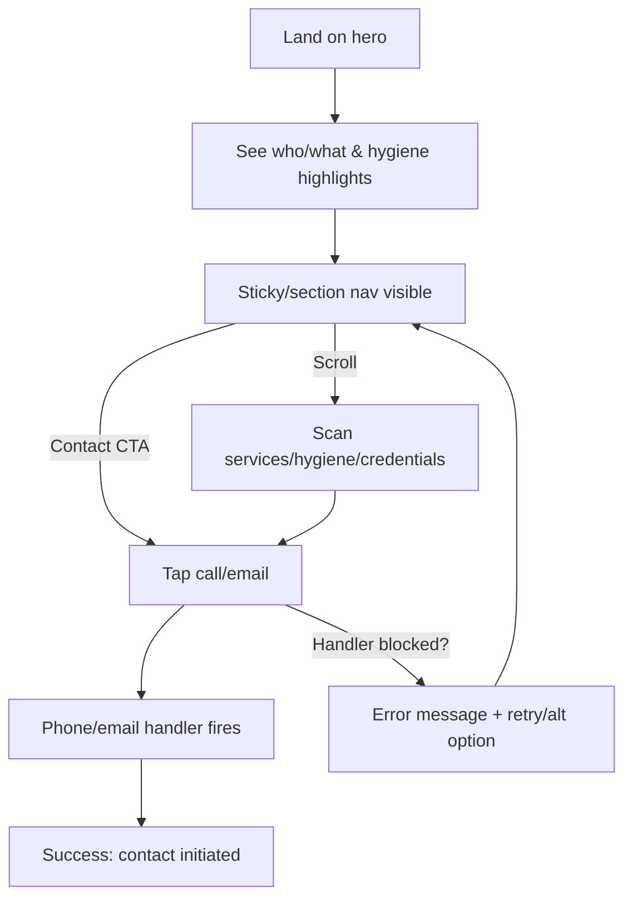

---
stepsCompleted:
  - 1
  - 2
  - 3
  - 4
  - 5
  - 6
  - 7
  - 8
  - 9
  - 10
  - 11
  - 12
  - 13
  - 14
  - 13
inputDocuments:
  - _bmad-output/planning-artifacts/prd.md
  - docs/index.md
---

# UX Design Specification staudt-fusspflege.de

**Author:** Deltatree
**Date:** 2025-12-30

---

<!-- UX design content will be appended sequentially through collaborative workflow steps -->

## Executive Summary

### Project Vision

A modern, mobile-first, trust-first brochure site for the podology practice that stays lightweight and static, removes legacy jQuery/plugins, and delivers WCAG 2.1 AA-oriented, high-performance pages with clear contact paths and a rewritten, clean Datenschutz page.

### Target Users

- Mobile visitors who need to see services, hygiene, and contact within a couple of scrolls/taps.
- Angehörige validating quality/hygiene and sharing contact/address details.
- Ärzte/partners verifying qualifications/treatment spectrum before referring.
- Maintainers who update static HTML/CSS/assets without build steps or backend.

### Key Design Challenges

- Reflow the fixed 860px layout into a responsive, multi-breakpoint experience without breaking galleries.
- Surface trust content (hygiene, qualifications) quickly while keeping contact always obvious on mobile.
- Achieve Lighthouse ≥ 90 (Performance & Accessibility) with minimal JS and no third-party bloat, while ensuring WCAG 2.1 AA basics (contrast, focus, headings, skip link).
- Rewrite the Datenschutz page in UTF-8 with clean structure and no hidden trackers.

### Design Opportunities

- Use a calm, clinic-quality visual language with clear hierarchy and generous spacing to build trust.
- Provide sticky/section navigation and tappable contact affordances that stay available across breakpoints.
- Simplify galleries with a responsive grid/lightbox that works without heavy plugins.
- Clarify content structure so each audience (visitors, Angehörige, Ärzte) can scan what they need in one to two sections.

## Core User Experience

### Defining Experience

A mobile-first, scrollable one-page experience that quickly surfaces who, what, hygiene standards, and how to contact. Users land, confirm trust, and tap to call/email within one to two interactions, with sections clearly chunked and anchored.

### Platform Strategy

Responsive web only (static hosting), optimized for mobile touch with solid desktop layouts. No backend/CMS, no offline expectations. JS optional for core content; avoid heavy plugins. Breakpoints ≤480, ≤768, ≥1024, ≥1440. Touch-friendly targets and sticky/section nav.

### Effortless Interactions

Contact initiation (tap-to-call/email) is always visible and works without JS. Section jumps via sticky/section nav feel instant and predictable. Galleries open cleanly and scale on mobile without pinching/zooming. Reading hygiene/qualification info requires no zoom; headings and spacing do the work.

### Critical Success Moments

- First scroll: immediate clarity of practice, services, hygiene, and contact.
- Tap-to-call/email: works on first try, no friction.
- Gallery open/close: responsive, legible captions/alt text, no layout breaks.
- Datenschutz view: clean, UTF-8, readable, no scary trackers or popups.

### Experience Principles

- Clarity first: prioritize scannable sections, short headings, and obvious contact affordances.
- Mobile-native: thumb-friendly targets, sticky/section nav, zero horizontal scroll.
- Lightweight & resilient: minimal JS, graceful no-JS behavior, fast loads.
- Trust by design: calm visuals, hygiene/qualification prominence, compliant privacy page.

## Desired Emotional Response

### Primary Emotional Goals

Calm reassurance and trust: users feel the practice is hygienic, professional, and caring. Confidence that contact is easy and welcome.

### Emotional Journey Mapping

- First arrival: calm, safe, welcomed (clear who/what/where, no clutter).
- Browsing services/hygiene: trust and relief (clean structure, plain language).
- Contact action: confidence (tap-to-call/email feels obvious, reliable).
- After task: assurance and satisfaction (they feel ready to book/visit).
- If something goes wrong: guided and supported (clear errors, easy recovery).

### Micro-Emotions

- Confidence over confusion (clear headings, anchors).
- Trust over skepticism (credentials/hygiene up front, no dark patterns).
- Relief over anxiety (readable spacing/contrast, no popups/trackers).
- Control over uncertainty (predictable nav, visible contact affordances).

### Design Implications

- Structure: calm visual language, generous spacing, predictable sticky/section nav.
- Content: plain German, short blocks, hygiene/credentials surfaced early.
- Interaction: frictionless tap-to-call/email; galleries responsive without fuss.
- States: clear focus/hover/active cues; friendly, specific error/retry messages; no hidden trackers or surprise modals.

### Emotional Design Principles

- Trust by clarity: surface credibility and hygiene first.
- Calm by design: avoid noise; keep layouts breathable and stable.
- Confidence through predictability: consistent nav and anchors; JS-optional core.
- Relief in action: contact always visible and works on first try; recovery paths are obvious.

## UX Pattern Analysis & Inspiration

### Inspiring Products Analysis

- GOV.UK Design System: ultra-clear hierarchy, plain language, generous spacing; shows how calm layouts aid trust and readability.
- Mayo Clinic site: medical trust signals up front, scannable services, clear contact paths; balances credibility with approachability.
- Apple Support mobile: sticky affordances, predictable anchored sections, readable at all sizes; excellent for touch-first navigation.

### Transferable UX Patterns

- Navigation: sticky/section nav with clear anchors; breadcrumb-like section headers for orientation.
- Interaction: tap-to-call/email as persistent affordances; responsive grid galleries that open lightweight modals without jank.
- Visual: high-contrast text, ample white space, calm accent color use; plain-language headings with short lead-ins.

### Anti-Patterns to Avoid

- Heavy carousels/lightboxes that break on mobile or require pinch/zoom.
- Hidden contact info or nav that disappears on scroll.
- Popups/trackers or surprise consent nags; dense wordy blocks without spacing.

### Design Inspiration Strategy

- Adopt: sticky/section nav and persistent contact actions to serve the core loop; plain-language, scannable sections like GOV.UK.
- Adapt: medical trust presentation from Mayo Clinic—surface hygiene/credentials early, keep tone warm and concise.
- Avoid: legacy plugin behaviors (auto-sliding carousels, heavy lightboxes) and any layout that forces zoom/horizontal scroll.

## Design System Foundation

### 1.1 Design System Choice

Lightweight custom mini design system (tokens + a small component set) built with vanilla CSS (Flex/Grid) and minimal JS. No heavyweight frameworks; keep it static-host friendly.

### Rationale for Selection

- Performance and simplicity: avoids large frameworks and build steps; suits static hosting.
- Brand fit: calm, clinic-quality visual language needs bespoke tuning, not a Material/Ant look.
- Maintainability: small token set and components are easy for occasional edits by maintainers without toolchains.

### Implementation Approach

- Core tokens via CSS variables: color palette (calm accent + neutrals), typography scale, spacing, radius, shadows, breakpoints (≤480, ≤768, ≥1024, ≥1440).
- Layout primitives: responsive stack/cluster/grid utilities; sticky/section nav pattern; readable content width.
- Components: header/nav with anchors, hero/intro band, service cards, hygiene/cred section, gallery grid + lightweight modal, contact bar (tap-to-call/email), footers/legal.
- Accessibility baked in: focus states, contrast, semantic headings/landmarks, skip link; JS-optional for core content.

### Customization Strategy

- Theming via tokens: swap accent shades and spacing density without structural rewrites.
- Content blocks as partials/snippets: services, hygiene, credentials, contact CTA; consistent padding/typography.
- Gallery/lightbox kept minimal and responsive; avoid carousels. JS only for nav toggles and modal open/close, no legacy plugins.

## 2. Core User Experience

### 2.1 Defining Experience

“See trust, act fast”: a mobile-first scroll that immediately confirms who/what/hygiene and keeps tap-to-call/email always within reach. Users land, glance trust signals, then tap contact in one to two interactions—no hunting, no zooming.

### 2.2 User Mental Model

Users expect a doctor/clinic page to read like a clean, scannable factsheet: who you are, what you do, hygiene/credentials, where to find you, and a big “call/email” action. They expect anchors or sticky nav, no carousels, no popups, and reliable tel/mail links that just work on mobile. Current pain: fixed-width, buried contact, plugin-heavy behaviors.

### 2.3 Success Criteria

- Contact reachable within one to two taps from any section; tel/mail work on first try.
- Trust signals (hygiene, credentials, services) visible in first scroll.
- Zero horizontal scroll; readable at mobile sizes; JS optional for core content.
- Galleries open/close smoothly without layout shift; captions/alt are legible.
- Clear feedback on nav jumps and any error/retry states.

### 2.4 Novel UX Patterns

No novel gestures; rely on proven patterns (sticky/section nav, anchored jumps, responsive grids, lightweight modal). Twist is ultra-lean, static, JS-optional implementation to keep perf/a11y high.

### 2.5 Experience Mechanics

- Initiation: Land on hero with immediate who/what and persistent contact bar or top-right CTAs; sticky/section nav visible.
- Interaction: Tap section links to jump; scroll through concise blocks (services, hygiene, credentials, gallery, contact); tap contact actions.
- Feedback: Nav highlights current section; smooth scroll; modal/gallery shows clear close affordance; visible focus states; tel/mail triggers device handlers cleanly.
- Completion: User has contacted (call/email) or feels informed to visit; optional save/share contact block; easy return to top.

## Visual Design Foundation

### Color System

- Palette: calm clinic accent (teal/green family), soft neutral background, high-contrast ink for text, subtle warning/error tones for forms if needed.
- Semantic mapping: primary = accent; neutrals for surfaces; success minimal; error for form validation only; avoid heavy chroma.
- Contrast: target WCAG AA/AAA for body and nav; ensure focus outlines meet contrast.
- Avoid gradients/heavy shadows; keep surfaces clean and breathable.

### Typography System

- Tone: professional, calm, readable.
- Stack: modern humanist sans (e.g., Source Sans/Inter fallback to system) with clear German diacritics; consider a serif for short pull quotes if desired.
- Scale: mobile-first type ramp (e.g., 32/24/20/18/16/14 with generous line-height 1.4–1.6); lock body at 16–17px min on mobile.
- Hierarchy: concise headings, short intros; consistent letter/word spacing for legibility.

### Spacing & Layout Foundation

- Spacing unit: 8px base; allow 4px sub-increments for fine-tuning.
- Layout: responsive stacks/clusters/grids; content max-width ~70–78ch on desktop; zero horizontal scroll on mobile.
- Sections: clear bands with generous vertical rhythm; sticky/section nav; anchored sections with visible headers.
- Components: cards for services; checklist/infoblocks for hygiene/credentials; responsive gallery grid with lightweight modal.

### Accessibility Considerations

- Contrast AA+; focus states always visible; skip link at top.
- Semantic headings/landmarks; predictable anchor targets; no reliance on JS for core content.
- Tap targets ≥44px; clear hover/focus/active cues; motion kept minimal and user-friendly.
- Forms/errors (if any): plain language, inline guidance, polite error styling with sufficient contrast.

## Design Direction Decision

### Design Directions Explored

- Variations on clean, airy layouts with sticky/section nav; calm clinic accent; high-contrast text; responsive grids; lightweight modal gallery.
- Options ranged from ultra-minimal (monochrome + teal accent) to slightly warmer neutrals with subtle texture; all avoided heavy shadows/gradients.

### Chosen Direction

- Clean, airy clinic aesthetic with teal/green accent, soft neutral backgrounds, high-contrast ink, and restrained use of color.
- Sticky/section nav with persistent contact actions; responsive grid for services/hygiene/gallery; lightweight modal for image enlarge; cards/checklists for trust content.

### Design Rationale

- Aligns with emotional goals (calm reassurance, trust) and core loop (“see trust, act fast”).
- Supports performance and static delivery: minimal JS, no heavy plugins, lean visuals.
- Matches accessibility goals: high contrast, clear hierarchy, predictable anchors, visible focus states.

### Implementation Approach

- Use the chosen token set (accent/neutral palette, type ramp, 8px spacing system, breakpoints ≤480/≤768/≥1024/≥1440).
- Build sticky/section nav + contact bar with JS-optional behavior; smooth scroll and clear section headers.
- Services/hygiene/credentials as cards/checklists; gallery as responsive grid + lightweight modal; tap-to-call/email always visible.
- Keep surfaces clean (no heavy gradients/shadows); ensure focus states and contrast meet WCAG AA+.

## User Journey Flows

### Besucher (mobil) – Kontakt in 2 Taps

- Goal: land, verify trust, tap-to-call/email quickly on mobile.
- Flow:



- Success: Contact triggered on first try; no zoom/horizontal scroll; trust signals seen in first scroll.
- Edge handling: show inline error/retry if handler blocked; contact CTA remains visible.

### Angehörige – Vertrauen + Teilen

- Goal: confirm hygiene/credentials, get contact/address to share.
- Flow:

```mermaid
flowchart TD
  L[Land on hero] --> H[Hygiene/credentials section]
  H --> A[Address/contact block]
  A --> Share[Copy/share or tap call/email]
  Share --> OK[Success: ready to visit/share]
  H --> Gal[Open gallery modal (hygiene visuals)]
  Gal --> A
  A -->|Needs directions?| Dir[Link to map/app (optional)]
  Dir --> OK
  A -->|Contact unavailable?| ER[Inline fallback info + retry]
  ER --> A
```

- Success: Clear credibility + contact/share path without friction; gallery doesn’t break layout.

### Ärzte/Partner – Qualifikation + Kontakt

- Goal: assess qualifications/treatment spectrum, then contact.
- Flow:

```mermaid
flowchart TD
  L[Land on hero] --> Q[Qualification/treatment spectrum]
  Q --> H[Hygiene summary]
  H --> C[Contact CTA (call/email)]
  C --> OK[Success: referral contact started]
  Q -->|Needs detail?| PDF[Downloadable/printable summary optional]
  PDF --> C
  C -->|Handler blocked?| ER[Retry alt channel]
  ER --> C
```

- Success: Qualifications + hygiene visible fast; contact works first time; optional printable summary.

### Journey Patterns

- Navigation: sticky/section nav with visible anchors; persistent contact CTA; smooth scroll with section highlight.
- Feedback: clear focus/active states; inline error/retry for contact handlers; modal/gallery with obvious close.
- Content blocks: concise cards/checklists for services/credentials/hygiene; responsive gallery grid + lightweight modal.

### Flow Optimization Principles

- Minimize steps: contact CTA always reachable; trust signals surfaced in first scroll.
- Reduce cognitive load: short headings, plain language, predictable anchors; avoid carousels/popups.
- Resilience: JS-optional core; graceful fallback for tel/mail handlers; no horizontal scroll; clear recovery paths.

## UX Consistency Patterns

### Button Hierarchy

- When to use: primary for contact (call/email) and key anchors; secondary for gallery open/close; tertiary/text for inline links.
- Visual: high-contrast ink on neutral or accent; ample padding (≥44px touch), clear focus ring.
- Behavior: no unexpected opens; smooth scroll on anchor buttons optional but JS-optional; disabled style only when necessary.
- Accessibility: real buttons/links with discernible text; focus/hover/active states visible; tel/mail use semantic links.

### Feedback Patterns

- Success: concise inline confirmation (e.g., “Copied”, “Opened mail app”), no popups.
- Error: inline message near the trigger; suggest alternative (copy number/email) if handler blocked; keep contact CTA visible.
- Info/Warning: short, plain language; avoid modal interruptions.
- Accessibility: color + icon/text; ensure contrast; announce changes via ARIA live regions only if JS present.

### Form Patterns (if forms added later)

- Layout: single-column, clear labels above inputs; required indicated textually.
- Validation: inline, real-time where possible; prevent submission with clear reason.
- Inputs: generous tap targets; native inputs; no custom selects unless necessary.
- Accessibility: associate labels/ids; describe errors inline; logical tab order; avoid placeholder-only labels.

### Navigation Patterns

- Sticky/section nav with visible anchors; section highlight on scroll; skip link at top.
- Contact CTA persistent (tel/mail); never hidden on scroll.
- Smooth scroll optional; ensure anchor targets have offset spacing for sticky header.
- Accessibility: `nav` landmarks; focus ring visible; anchors readable; no keyboard traps.

### Additional Patterns

- Modal/overlay: used for gallery enlarge only; close button always visible; ESC/overlay click closes; focus trap; `aria-modal="true"`.
- Empty/loading: show skeleton or simple text placeholders; no spinners that block; keep contact info accessible.
- Media: responsive images; captions optional but readable; alt text required; no auto-play.
- Copy/share: provide copy feedback text; fall back gracefully if share API unavailable.

## Responsive Design & Accessibility

### Responsive Strategy

- Mobile-first: prioritize hero trust signals, sticky/section nav, and always-visible contact bar. Single-column stacks; no horizontal scroll.
- Tablet: two-column where helpful (e.g., text + image), maintain sticky/section nav, touch-friendly spacing.
- Desktop: widen to ~70–78ch content max-width; allow 2–3 columns for services/gallery; keep contact CTA prominent.
- Interactions: smooth scroll optional; ensure anchor targets account for sticky header offset; no reliance on hover for critical actions.

### Breakpoint Strategy

- Base mobile-first queries with custom breakpoints aligned to goals: ≤480, ≤768, ≥1024, ≥1440.
- Collapse nav to a simple sticky bar on mobile; expand spacing/columns progressively.
- Test common devices: iPhone SE/mini, mid Android, iPad portrait/landscape, desktop 1280–1440+, and large desktop.

### Accessibility Strategy

- Target WCAG 2.1 AA; aim higher on contrast where feasible.
- Semantic HTML with landmarks; skip link; logical heading order.
- Touch targets ≥44px; visible focus states; keyboard operable sticky nav, modals, and contact links.
- Alt text for all images; no autoplay media; color is not sole signal.

### Testing Strategy

- Responsive: real devices + devtools for listed breakpoints; check sticky nav/anchors, gallery modal, and contact CTA across viewports.
- Accessibility: keyboard-only nav; screen readers (VoiceOver/NVDA); automated a11y checks; color contrast checks; color-blind sims.
- Performance: mobile Lighthouse runs (Perf/Accessibility); throttle network for mobile; ensure JS-optional core paths still work.

### Implementation Guidelines

- Mobile-first CSS with rem/% units; media queries at defined breakpoints; avoid fixed widths.
- Optimize images (responsive sizes, modern formats where possible); ensure no layout shift on gallery/modal.
- Ensure focus management (modals trap/ESC/close button, skip link target); anchor offsets for sticky header.
- Keep JS minimal: smooth scroll optional; modals and nav toggles only; contact links remain standard tel/mailto.

## Component Strategy

### Design System Components

- Tokens: color palette (accent/neutral), type ramp, spacing (8px with 4px fine-tune), radius/shadow minimal, breakpoints ≤480/≤768/≥1024/≥1440.
- Layout primitives: stack/cluster/grid utilities; section wrappers with readable max-width; sticky/section nav pattern; skip link.
- UI elements: buttons/links (primary/ghost/text), cards/infoblocks, list/checklists, hero/intro band, footer/legal band.
- Media: responsive gallery grid + lightweight modal; image/caption styles; responsive embeds optional.
- Contact/navigation: sticky/section nav, persistent contact CTA bar, anchor targets with smooth scroll and section highlights.

### Custom Components

#### Contact Bar (persistent)
- Purpose: keep call/email always reachable.
- Usage: top-right on desktop; bottom bar or inline hero on mobile; stays visible on scroll.
- States: default, focus/hover/active; error fallback if handler blocked.
- Accessibility: semantic links with `tel:`/`mailto:`, visible focus ring, aria-label for action text; no JS dependency for core.

#### Sticky Section Nav
- Purpose: fast jumps to sections (profil, leistungen, hygiene, galerie, kontakt, datenschutz).
- Usage: horizontal strip; highlights current section; smooth scroll optional.
- States: default, active/selected, focus/hover.
- Accessibility: `nav` landmark; anchor links with clear text; maintain focus order; no hidden contact.

#### Service Cards
- Purpose: concise treatments overview.
- Usage: grid or list; icon/heading/short body; optional link to detail anchor.
- States: default, hover/focus.
- Accessibility: headings for scan, sufficient contrast; focusable card if interactive.

#### Hygiene Checklist / Credentials Strip
- Purpose: trust signals (sterilization steps, qualifications).
- Usage: checklist bullets with icons; badges for credentials.
- States: default; focus/hover on interactive elements only.
- Accessibility: list semantics; text labels; avoid icon-only info.

#### Gallery Grid + Modal
- Purpose: view hygiene/practice photos responsively.
- Usage: responsive grid; modal/lightbox minimal for enlarge.
- States: default grid; modal open/close; loading/fallback image.
- Accessibility: buttons with labels, focus trap in modal, `aria-modal="true"`, ESC/close button; alt text on images.

#### Address/Share Block
- Purpose: shareable contact/address with map link option.
- Usage: block with address, tel/email, copy/share affordance; optional “open in maps”.
- States: default; feedback on copy/share; error fallback.
- Accessibility: use `address` semantics; button labels; maintain contrast.

#### Datenschutz Page Layout
- Purpose: clean UTF-8 privacy content in consistent layout.
- Usage: structured headings, lists, and links; same tokens as main page; no inline Word styles.
- States: default, focus/hover for links.
- Accessibility: semantic headings, table/list semantics; readable line-length; high contrast.

### Component Implementation Strategy

- Build with semantic HTML + design tokens; vanilla CSS (Flex/Grid); minimal JS for smooth scroll, nav toggle, modal open/close, focus management.
- No external plugins; keep JS optional for core content and contact actions.
- Enforce accessibility: focus rings, skip link, nav landmarks, modal focus trap/ESC, alt text, contrast checks.
- Reuse primitives (stack/cluster/grid, cards, buttons) to keep CSS small and maintainable.

### Implementation Roadmap

- Phase 1 (core flows): sticky/section nav, contact bar, hero/intro, service cards, hygiene checklist/credentials strip, address/share block, gallery grid + modal, footer/legal, Datenschutz page layout.
- Phase 2 (supporting): map/deeplink option, printable/“download summary” block, section header variants, inline alerts for contact errors.
- Phase 3 (enhancements): micro-animations (subtle), density variants, print stylesheet, optional PDF summary styling.
